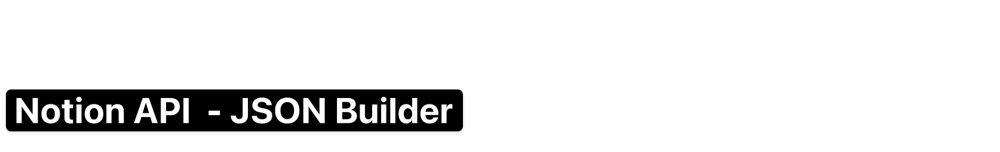

Welcome to the Notion API JSON Builder!

This humble little app is here to help you tackle one of the trickiest parts of working with the Notion API—constructing complex JSON structures. Whether you’re configuring properties for your Notion databases or building dynamic blocks to append to your pages, this app simplifies the process.

With a user-friendly interface, you can easily set up properties like titles, text, numbers, and more, or generate blocks like headings, lists, and to-dos. No more guesswork when building JSON for Notion!

Our goal is to make your life easier when working with Notion, whether you’re creating dynamic dashboards or detailed documents. If you’re juggling database properties or adding rich blocks of content, this app will save you time and energy.

Give it a try, and happy building!

